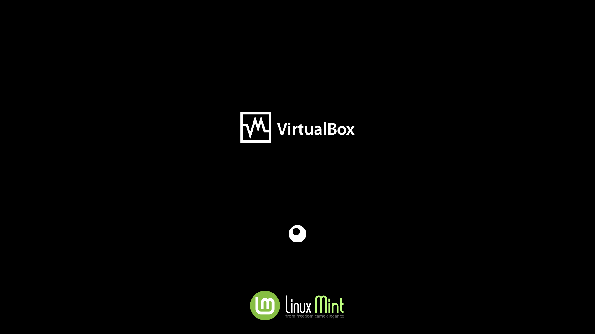
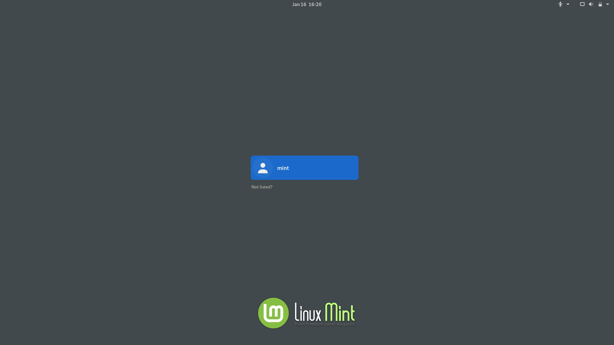
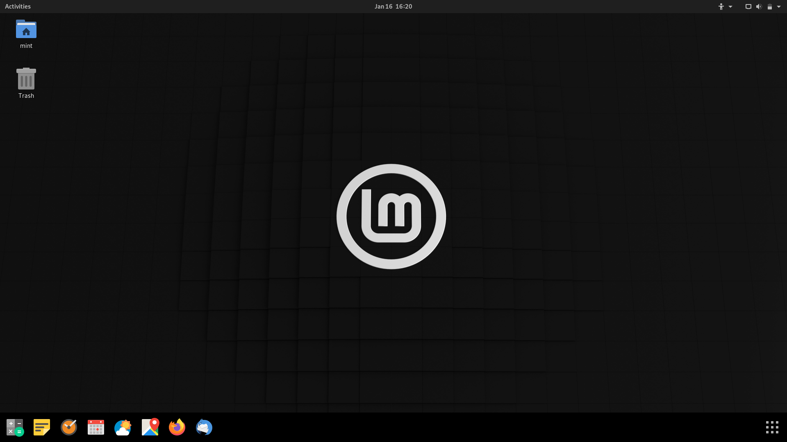
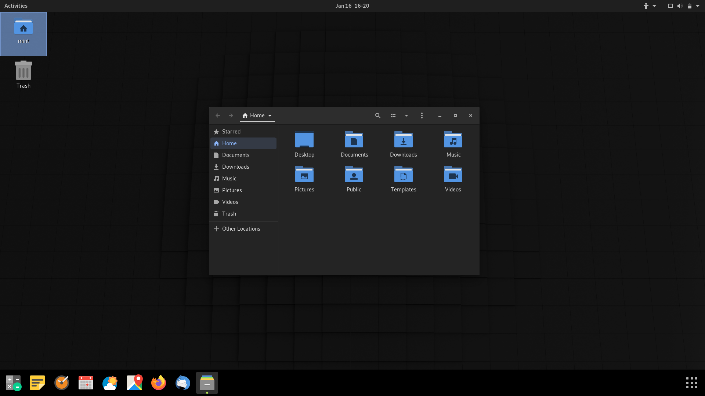
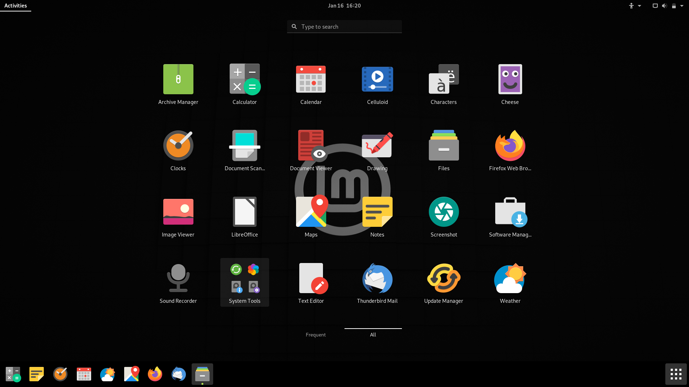

# Linux Mint Gnome
Who needs a description? Everything is in the title!

I'm not afiliated with Linux Mint, this is a "fan-made" distribution without any pretension.

## Screenshots

### Plymouth boot screen


### GDM3 login screen


### Gnome-shell desktop


### Nautilus file manager


### Gnome-shell app grid


## Installation

- Get a Linux Mint 20 Cinnamon ISO (theoricaly, it can work with any edition, but only tested on Cinnamon for now, and the uninstall command does not remove the Mate and XFCE packages)
- Use this ISO to install Mint on a computer or a virtual machine (WARNING: your computer may be wiped, depending of what you choose to do at the installation)
- Download the 'mint-gnome-desktop.deb' package in the 'Releases' section of this Git (you dont need the others .deb, they are embedded in 'mint-gnome-desktop')
- On the Mint installed machine, open a terminal
```bash
sudo apt update
sudo gdebi /path/to/mint-gnome-desktop.deb # Select 'gdm3' instead of 'lightdm' when asked
sudo reboot
```
- You should now get the GDM3 login screen, log in
- Re-open a terminal
```bash
sudo apt autoremove --purge cinnamom cinnamon-common cinnamon-control-center cinnamon-control-center-data cinnamon-control-center-dbg cinnamon-desktop-data cinnamon-l10n cinnamon-screensaver cinnamon-session cinnamon-session-common cinnamon-settings-daemon dmz-cursor-theme gnome-power-manager gnote gucharmap hexchat humanity-icon-theme lightdm lightdm-settings mint-themes mint-x-icons mint-y-icons mintlocale mintwelcome nemo nemo-data nemo-emblems onboard pix redshift redshift-gtk rhythmbox transmission-common transmission-gtk ubuntu-mono ubuntu-session warpinator xed xreader xviewer yaru-theme-gnome-shell
```
- Log out and log in again
- Enjoy!

## New packages

- mint-gnome-desktop: A package which embed all the necessary to install Mint Gnome from any official edition of Mint 20
- mint-gnome-core: The distribution base package (welcome screen, Gnome extensions and .desktop files)
- mint-gnome-wallpapers: It contains the sames wallpapers as Linux Mint ones. 'mint-artwork' doesn't works in Gnome.
- gnome-customization: 'gnome-tweaks', only better (customize Gnome, themes, extensions, QT5, GDM3, Plymouth and Grub)
- plymouth-theme-mint: Boot screen which support UEFI manufacturer logo (BGRT), based on and requires 'plymouth-theme-spinner'
- papirus-cursor-theme: I did not do anything, those are the cursors from snwh's 'Paper' icon theme
- libreoffice-style-papirus: The same, this package is just not available without a PPA

## Remaining work

- Publish an autoremove script which also remove the Mate and XFCE packages (to avoid to type the hyper long autoremove command)
- Create a default configuration for new users (Templates folder, Gnome, Firefox, Thunderbird, LibreOffice, Nautilus, Gedit...)
- Publish these new .deb files (eventualy in a repository, a PPA or just in Git... I don't know)
- Create an autonomous LiveCD ISO (at this stage I would have already made good progress)
- Make the GDM3 login screen themable (for now, GDM3 crashes when I link 'gdm3-theme.gresource' with a third party gnome-shell theme)
- Develop the welcome screen and develop 'gnome-customization' (for now, these are just Zenity info boxes)
