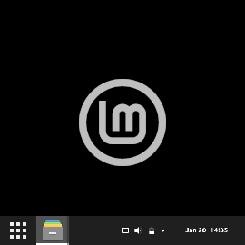
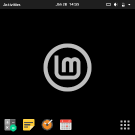
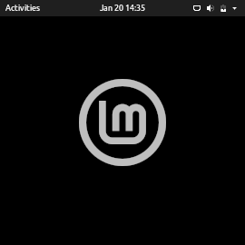
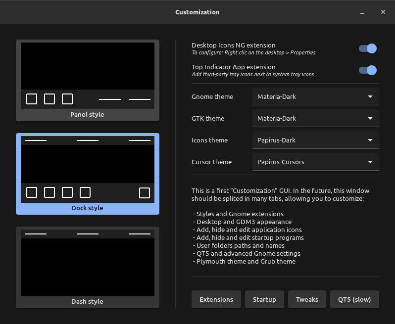
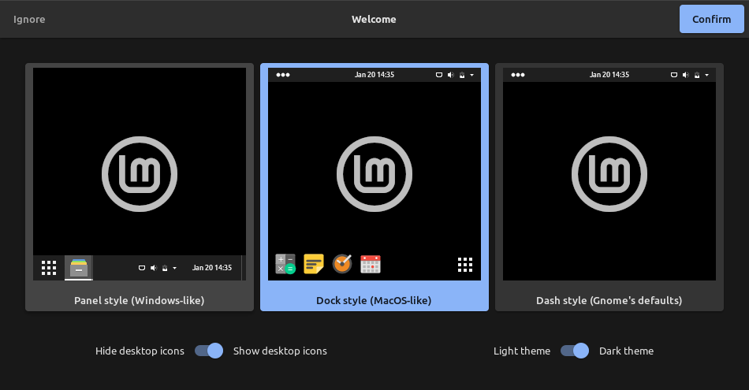

# Linux Mint Gnome

Who needs a description? Everything is in the title!

This distribution embeds 'Dash to Panel', 'Dash to Dock' and other Gnome extensions.
On first login, you can choose between a 'panel style' (Windows-like), a 'dock style' (macOS-like) or a 'dash style' (Gnome's defaults), whether or not to display desktop icons, and to opt for a light or a dark theme (everything can be changed later in 'Customization').

I'm not afiliated with Linux Mint, this is a "fan-made" distribution without any pretension.

## Screenshots

<table>
  <tbody>
    <tr>
      <td colspan="3"></td>
    </tr>
    <tr>
      <td colspan="3"> <i>Click on one of the three styles below ("Panel", "Dock" and "Dash"), or check the <b><a href="https://github.com/pl453s/linux-mint-gnome/blob/main/tour/tour.md">INTERACTIVE TOUR</a></b></i> </td>
    </tr>
    <tr>
      <td colspan="3"></td>
    </tr>
    <tr>
      <td> <a href="tour/panel.md"></a> </td>
      <td> <a href="tour/dock.md"></a> </td>
      <td> <a href="tour/dash.md"></a> </td>
    </tr>
  </tbody>
</table>

<table>
  <tbody>
    <tr>
      <td colspan="2"> <i>Python GTK windows ("Welcome" and "Customization")</i> </td>
      <td rowspan="2"> <a href="btn/customization.png"></a> </td>
    </tr>
    <tr>
      <td colspan="2"> <a href="btn/welcome.png"></a> </td>
    </tr>
  </tbody>
</table>

## Installation (1.6)

**WARNING: Your computer may be wiped, depending of what you choose to do at the installation.**  
**WARNING: Updates has not been tested yet, you are warned, be very careful and know what you do.**
- Download the ISO: [https://github.com/pl453s/linux-mint-gnome/releases/download/ISO-v1.6-mint20/lmg.iso](https://github.com/pl453s/linux-mint-gnome/releases/download/ISO-v1.6-mint20/lmg.iso)
- Burn it on a disk, or flash it on an USB flash drive, or just insert it in a virtual machine
- Boot your disk or your USB flash drive, and test or install the distribution

## Migration / Upgrade (1.6)

Mint Gnome development has become too complex to support scripted migration from official Mint editions.  
Now, the DEB files will be released "as is", use them to migrate by yourself or to upgrade your Mint Gnome installation.  
A separate ISO file will be published, once at a time, each time the project has evolved enough and is stable enough.

Latest release: [https://github.com/pl453s/linux-mint-gnome/releases/tag/v1.6-mint20](https://github.com/pl453s/linux-mint-gnome/releases/tag/v1.6-mint20)

## Project packages

- mint-gnome-core: Welcome screen, Gnome extensions, .desktop files, default schemas and default user folder
- mint-info-gnome: Necessary information about the Linux Mint release and edition (here Gnome)
- mint-gnome-theme: 'Materia' theme with some fixes (on screen keyboard icons + app-folder bug)
- mint-gnome-control-center: 'Settings' application with some fixes (remove Appearance + Whoopsie)
- mint-gnome-control-center-data: 'Settings' application data with some fixes (use Linux Mint logo icon)
- gnome-customization: 'gnome-tweaks', only better (customize Gnome, QT5, GDM3, Plymouth and Grub)
- plymouth-theme-mint: Spinner boot screen which supports UEFI manufacturer logo (BGRT)
- papirus-cursor-theme: Cursors from 'Paper' icon theme
- libreoffice-style-papirus: LibreOffice 'Papirus' style icon pack

## Gnome Customization

- A first draft window has been created. The final aim is to create a central GUI to customize:  
styles, extensions, appearance, applications grid, user's folders paths, Gnome, QT5, GDM3, Plymouth and Grub.
- The user's folders names localization is intentionally disabled. A section to change these names is planned.
- Until 'Customization' is developed, I created a set of basic tools to more easily customize GDM3:
```bash
# With 'gnome-customization' installed, run for example:
gdm3-patch /usr/share/themes/Materia-Dark gnome-shell.css
# If a theme is incompatible and makes crash GDM3, login to another TTY and run:
gdm3-reset

# And some GDM3 settings:
gdm3-tweak false false true false false Materia-Dark Papirus-Dark Papirus-Cursors /usr/share/plymouth/themes/mint-spinner/watermark.png
# Parameters: <battery %?> <weekday?> <date?> <seconds?> <week n°?> <GTK theme> <icons theme> <cursors theme> [watermark path]
# '<...?>' should be 'true' or 'false' ; [watermark path] should be a path to an image, or nothing to remove the watermark
```

## Remaining work

- MintTools Gnome integration
- Nautilus extension: Folder color switch
- Nautilus extension: Fix "Paste Into Folder" bug
- Nautilus extension: Open as administrator
- Desktop Icons NG: Fix separator issues
- Desktop Icons NG: Improve localization
- Develop Gnome Customization
- ISO full test + Test installing updates
- PUBLISH A NEW ISO FILE

## Credits

- 'Top Indicator extension' forked by 'quiro9' --> [https://github.com/ubuntu/gnome-shell-extension-appindicator](https://github.com/ubuntu/gnome-shell-extension-appindicator)
- 'Desktop Icons NG extension' created by 'rastersoft' --> [https://gitlab.com/rastersoft/desktop-icons-ng](https://gitlab.com/rastersoft/desktop-icons-ng)
- 'Dash to Panel extension' created by 'jderose9' --> [https://github.com/home-sweet-gnome/dash-to-panel](https://github.com/home-sweet-gnome/dash-to-panel)
- 'Dash to Dock extension' created by 'micheleg' --> [https://github.com/micheleg/dash-to-dock](https://github.com/micheleg/dash-to-dock)
- 'Papirus icon theme' created by 'varlesh' --> [https://github.com/PapirusDevelopmentTeam/papirus-icon-theme](https://github.com/PapirusDevelopmentTeam/papirus-icon-theme)
- 'Paper icon theme' created by 'snwh' --> [https://github.com/snwh/paper-icon-theme](https://github.com/snwh/paper-icon-theme)
- 'Materia GTK theme' created by 'nana-4' --> [https://github.com/nana-4/materia-theme](https://github.com/nana-4/materia-theme)
