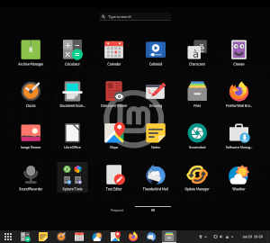
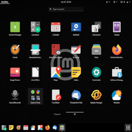
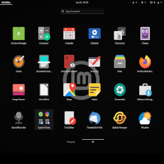

# Linux Mint Gnome
Who needs a description? Everything is in the title!

This distribution embed 'dash-to-panel', 'dash-to-dock' and others Gnome extensions.

On first login, you can choose between a 'panel style' (Windows like), a 'dock style' (MacOS like) or a 'dash style' (Gnome default).

You also choose to display desktop icons or not, and use a light or a dark theme (everything can be changed later in 'Customization').

I'm not afiliated with Linux Mint, this is a "fan-made" distribution without any pretension.

## Screenshots

*Click on one of the three styles below ( PANEL / DOCK / DASH )*

[](https://github.com/pl453s/linux-mint-gnome/blob/main/panel.md)
[](https://github.com/pl453s/linux-mint-gnome/blob/main/dock.md)
[](https://github.com/pl453s/linux-mint-gnome/blob/main/dash.md)

## Installation

- Get a Linux Mint 20 Cinnamon ISO https://linuxmint.com/release.php?id=38 (theoricaly, it can work with any edition, but only tested on Cinnamon for now, and the uninstall command does not remove the Mate and XFCE packages, should be fixed soon)
- Use this ISO to install Mint on a computer or a virtual machine (WARNING: your computer may be wiped, depending of what you choose to do at the installation)
- Download the 'mint-gnome-desktop.deb' package in the 'Releases' section of this Git (you dont need the others .deb, they are embedded in 'mint-gnome-desktop')
- On the Mint installed machine, open a terminal (BE SURE TO HAVE AN INTERNET CONNEXION ON YOUR MACHINE!)
```bash
sudo apt update
sudo gdebi /path/to/mint-gnome-desktop.deb # Select 'gdm3' instead of 'lightdm' when asked
sudo reboot # Alternatively, you cant switch to a console TTY, stop 'lightdm.service' and start 'gdm.service'
```
- You should now get the GDM3 login screen, log in and re-open a terminal
```bash
sudo apt autoremove --purge cinnamon cinnamon-common cinnamon-control-center cinnamon-control-center-data cinnamon-control-center-dbg cinnamon-desktop-data cinnamon-l10n cinnamon-screensaver cinnamon-session cinnamon-session-common cinnamon-settings-daemon dmz-cursor-theme gnome-power-manager gnote gucharmap hexchat humanity-icon-theme lightdm lightdm-settings mintlocale mintwelcome nemo nemo-data nemo-emblems onboard pix redshift redshift-gtk rhythmbox transmission-common transmission-gtk ubuntu-mono ubuntu-session warpinator xed xreader xviewer yaru-theme-gnome-shell
```
- Log out and log in again
- Enjoy!

## Future instructions (DON'T USE THESE COMMANDS FOR NOW!)

- ~~Get a Linux Mint 20 Cinnamon ISO https://linuxmint.com/release.php?id=38 (I strongly advise against migrate from a live session, install Mint permanently)~~
- ~~Use this ISO to install Mint on a computer or a virtual machine (WARNING: your computer may be wiped, depending of what you choose to do at the installation)~~
- ~~Download the lastest release packages and scripts~~
```bash
wget https://github.com/pl453s/linux-mint-gnome/releases/download/v1.1-mint20/mint-gnome-desktop.deb
wget https://github.com/pl453s/linux-mint-gnome/releases/download/v1.1-mint20/mint-gnome-core.deb
wget https://github.com/pl453s/linux-mint-gnome/releases/download/v1.1-mint20/mint-info-gnome.deb
wget https://github.com/pl453s/linux-mint-gnome/releases/download/v1.1-mint20/gnome-customization.deb
wget https://github.com/pl453s/linux-mint-gnome/releases/download/v1.1-mint20/plymouth-theme-mint.deb
wget https://github.com/pl453s/linux-mint-gnome/releases/download/v1.1-mint20/papirus-cursor-theme.deb
wget https://github.com/pl453s/linux-mint-gnome/releases/download/v1.1-mint20/libreoffice-style-papirus.deb
wget https://github.com/pl453s/linux-mint-gnome/releases/download/v1.1-mint20/script_install_1.sh
wget https://github.com/pl453s/linux-mint-gnome/releases/download/v1.1-mint20/script_install_2.sh
```
- ~~On the Mint installed machine, open a terminal (be sure to have an Internet connection on your machine!)~~
```bash
bash /path/to/script_install_1.sh # Confirm every installation and select gdm3 instead of lightdm when asked
reboot
```
- ~~You should now get the GDM3 login screen, log in and re-open a terminal~~
```bash
bash /path/to/script_install_2.sh # Confirm uninstallation
reboot
```
- ~~Log in again, and enjoy!~~

## New packages

- mint-gnome-desktop: A package which migrate to Linux Mint Gnome from any official edition of Mint 20
- mint-gnome-core: The distribution base package (welcome screen, Gnome extensions and .desktop files)
- mint-info-gnome: Necessary information about the Linux Mint release and edition (here Gnome)
- gnome-customization: 'gnome-tweaks', only better (customize Gnome, themes, extensions, QT5, GDM3, Plymouth and Grub)
- plymouth-theme-mint: Boot screen which support UEFI manufacturer logo (BGRT), based on and requires 'plymouth-theme-spinner'
- papirus-cursor-theme: I did not do anything, those are the cursors from snwh's 'Paper' icon theme
- libreoffice-style-papirus: The same, this package is just not available without a PPA

## Remaining work

- Check it works from Mate and XFCE, fix DashToPanel arrow bug, set DashToPanel margin to 4 --> publish v1.1 release)
- Create a default configuration for new users (Templates folder, Gnome, Firefox, Thunderbird, LibreOffice, Nautilus, Gedit...)
- Host the new packages somewhere (eventualy in a repository, a PPA or just in Git... I don't know)
- LiveCD: Put 'boot-repair' (with 'mx-boot-repair' Papirus icon) and 'ubiquity' on the desktop for and block 'hide desktop icons'
- Replace 'Linux Mint 20 Cinnamon' by 'Linux Mint 20 Gnome' (in Grub entries for example)
- Create an autonomous LiveCD ISO (at this stage I would have already made good progress)
- Make the GDM3 login screen themable (for now, GDM3 crashes when I link 'gdm3-theme.gresource' with a third party gnome-shell theme)
- Develop the welcome screen and develop 'gnome-customization' (for now, these are just Zenity info boxes)
