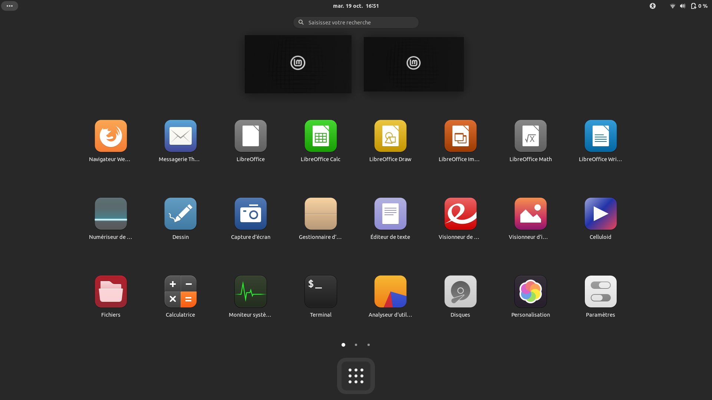
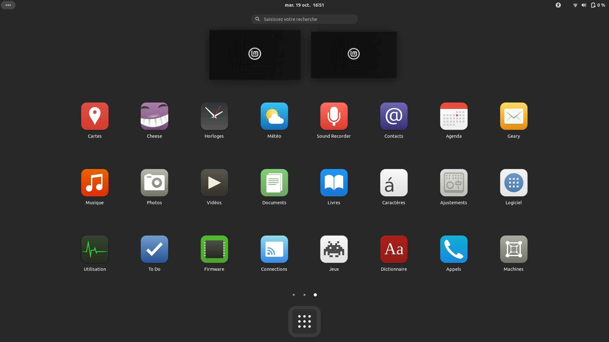
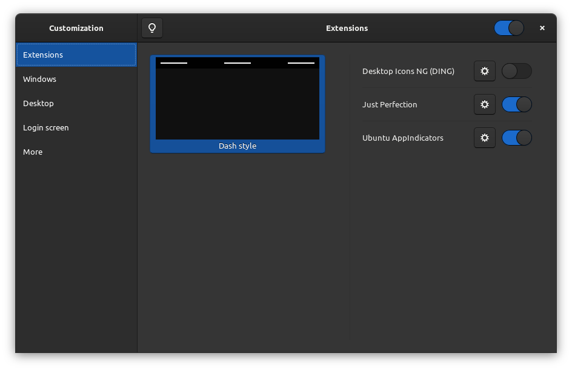
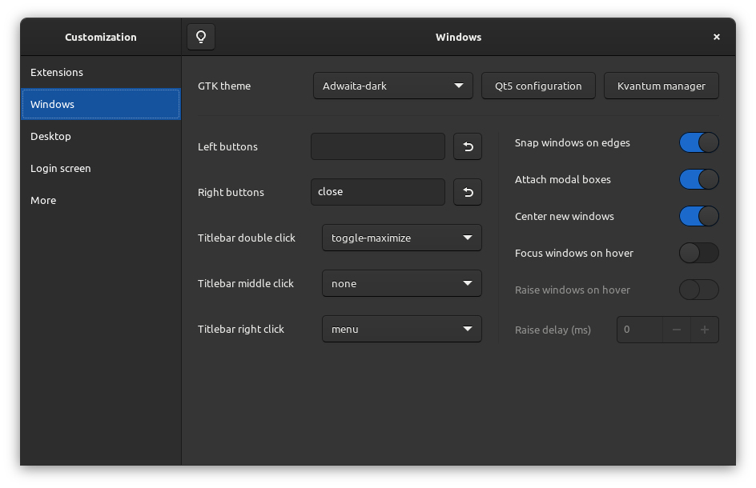
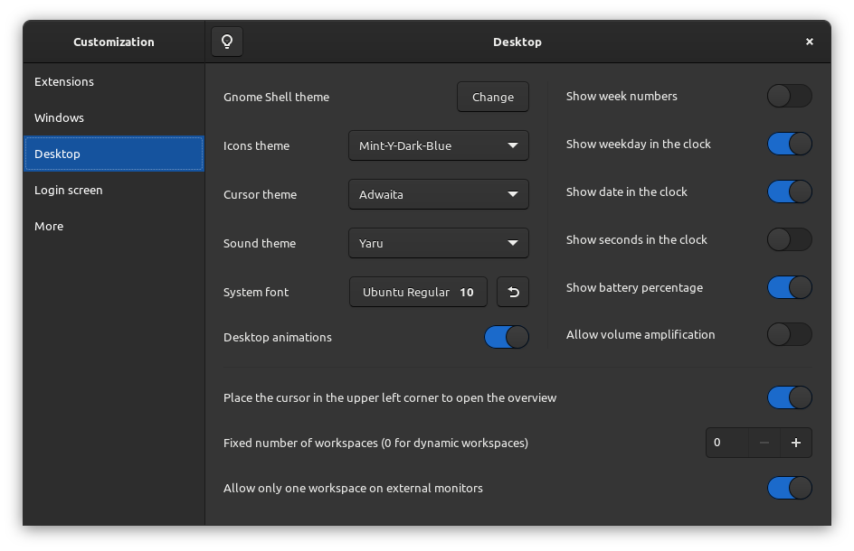
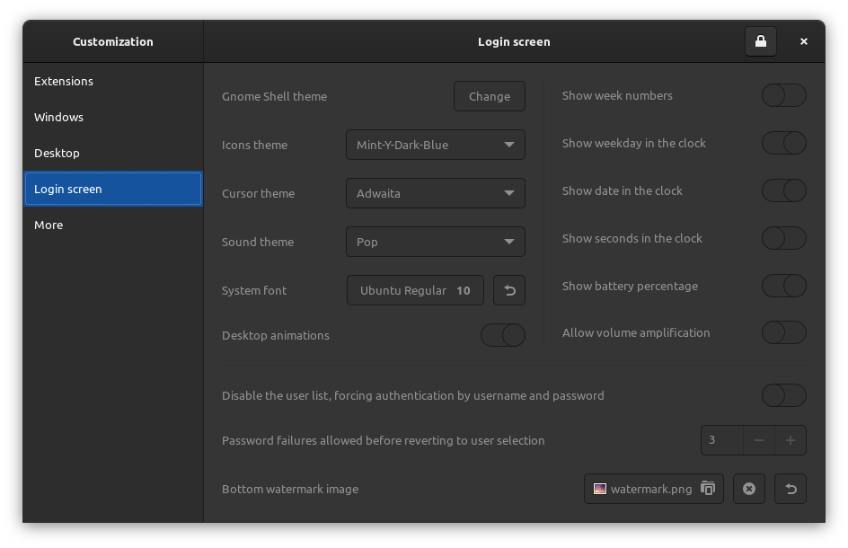
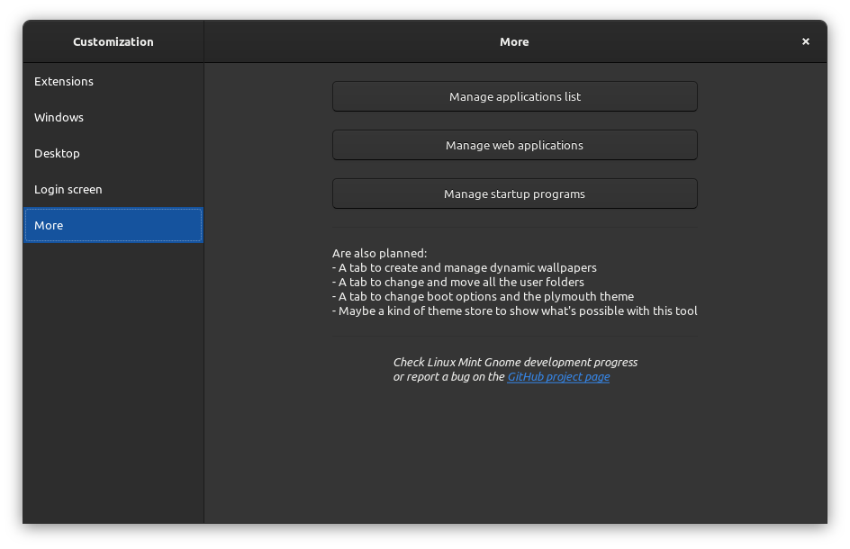

**NOTICE: If there're people which are really interested in my project (well, firstly, thanks!), I didn't give up this project, with the recent Ubuntu Impish release (and its Gnome 40 version), I downloaded the upgrade and I'm working again on this project. There is an overview:**
- Matches better the Mint style by using the Mint-Y icon theme (with some fixes to the missing Gnome icons)
- Uses Adwaita (light or dark) by default for cursor, GTK and Gnome (improve stability)
- Replaces the weird Gnome theme patcher by a simple 'update-alternative' menu in Customization
- Suggests custom theme (Materia, Yaru...) for Gnome and Plymouth as DEB packages
- Includes "Just Perfection" Gnome extension by default (to remove topbar corner, appmenu and replace 'Activities' by 3 dots)
- Adds a 'Windows' tab in Customization to change GTK and QT theme, and tweak windows
- Adds the ability to change the sound theme in Customization (I want to complete the "LinuxMint" theme and add a "Disabled" theme)

<table>
  <tr>
    <td></td>
    <td></td>
  </tr>
  <tr>
    <td></td>
    <td></td>
    <td></td>
    <td></td>
    <td></td>
  </td>
</table>
    

# Linux Mint Gnome

Who needs a description? Everything is in the title!

This distribution embeds 'Dash to Panel', 'Dash to Dock' and other Gnome extensions. On first login, you can  
choose between a 'panel style' (Windows-like), a 'dock style' (macOS-like) or a 'dash style' (Gnome's defaults).  
You can find a tool called 'Customization'. This is a personalization control center for the Gnome desktop.  
It is developed for the distribution, but is theoretically compatible with any distribution using Gnome.

**Overview of the distribution:** [https://github.com/pl453s/linux-mint-gnome/blob/main/github/tour.md](https://github.com/pl453s/linux-mint-gnome/blob/main/github/tour.md)

## Installation (2.0)

**WARNING: Your computer may be wiped, depending of what you choose to do at the installation.**  
**WARNING: Updates has not been tested yet, you are warned, be very careful and know what you do.**

- Download the ISO: [https://github.com/pl453s/linux-mint-gnome/releases/download/ISO-v2.0-mint20/lmg.iso](https://github.com/pl453s/linux-mint-gnome/releases/download/ISO-v2.0-mint20/lmg.iso)
- Burn it on a disk, or flash it on an USB flash drive, or just insert it in a virtual machine
- Boot your disk or your USB flash drive, and test or install the distribution

 

**You can also migrate from an official Mint edition installation or upgrade your Mint Gnome installation:**  
**WARNING: Some symlinks are missing to avoid breaking GitHub Pages ; refer to the 'symlinks' file**

Mint Gnome development has become too complex to support scripted migration from official Mint editions.  
Now, the DEB files will be released "as is", use them to migrate by yourself or to upgrade your Mint Gnome installation.  
A separate ISO file will be published, once at a time, each time the project has evolved enough and is stable enough.

Latest release (2.0): [https://github.com/pl453s/linux-mint-gnome/releases/tag/v2.0-mint20](https://github.com/pl453s/linux-mint-gnome/releases/tag/v2.0-mint20)

## Project packages

- mint-gnome-core: Mint Gnome session, various adjustments, default schemas and default user folder
- mint-gnome-control-center: 'Settings' application with some fixes (remove Appearance + Whoopsie)
- mint-gnome-control-center-data: 'Settings' application data with some fixes (use Linux Mint logo icon)
- mint-gnome-control-center-faces: 'Settings' application faces with some fixes (less available faces)
- mint-gnome-extensions : 'Dash to Panel', 'Dash to Dock', 'Desktop Icons NG' and 'Top Indicator App'
- mint-gnome-theme: 'Materia' theme with some fixes (app folder and on screen keyboard)
- mint-gnome-artwork: Mint + Gnome Wallpapers and Mint logos icons
- mint-gnome-welcome: First login Python GTK welcome screen (change style, desktop and theme)
- gnome-customization: 'Gnome Tweaks', only better (customize Gnome, Qt5, GDM3, Plymouth and Grub)
- plymouth-theme-mint: Spinner boot screen which supports UEFI manufacturer logo (BGRT)
- papirus-cursor-theme: Cursors from 'Paper' icon theme
- libreoffice-style-papirus: LibreOffice 'Papirus' style icon pack
- mint-info-gnome: Necessary information about the Linux Mint release and edition (here Gnome)

## Remaining work

- Nautilus extension: Folder color switch
- Nautilus extension: Fix "Paste Into Folder" bug
- Nautilus extension: Open terminal (only background)
- Nautilus extension: Open as administrator
- ISO full test + Test installing updates
- Gnome Customization: Continue development

## Credits

- 'Linux Mint' developed by the 'Linux Mint Team' --> [https://github.com/linuxmint](https://github.com/linuxmint)
- 'Dash to Panel extension' created by 'jderose9' --> [https://github.com/home-sweet-gnome/dash-to-panel](https://github.com/home-sweet-gnome/dash-to-panel)
- 'Dash to Dock extension' created by 'micheleg' --> [https://github.com/micheleg/dash-to-dock](https://github.com/micheleg/dash-to-dock)
- 'Desktop Icons NG extension' created by 'rastersoft' --> [https://gitlab.com/rastersoft/desktop-icons-ng](https://gitlab.com/rastersoft/desktop-icons-ng)
- 'Top Indicator extension' forked by 'quiro9' --> [https://github.com/ubuntu/gnome-shell-extension-appindicator](https://github.com/ubuntu/gnome-shell-extension-appindicator)
- 'Materia GTK theme' created by 'nana-4' --> [https://github.com/nana-4/materia-theme](https://github.com/nana-4/materia-theme)
- 'Papirus icons theme' created by 'varlesh' --> [https://github.com/PapirusDevelopmentTeam/papirus-icon-theme](https://github.com/PapirusDevelopmentTeam/papirus-icon-theme)
- 'Paper icons theme' created by 'snwh' --> [https://github.com/snwh/paper-icon-theme](https://github.com/snwh/paper-icon-theme)
