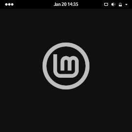
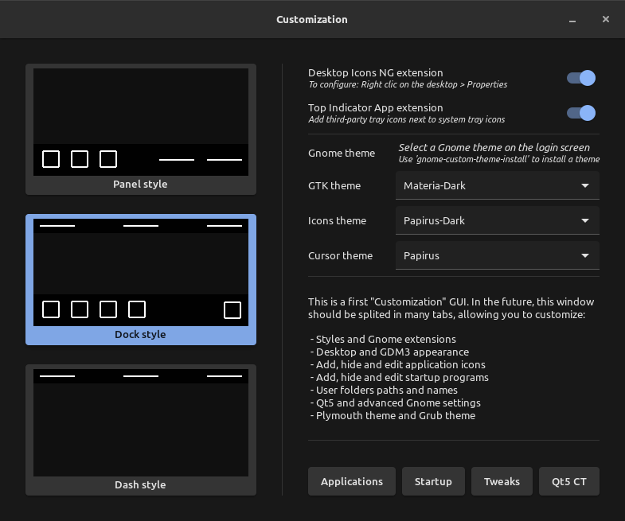
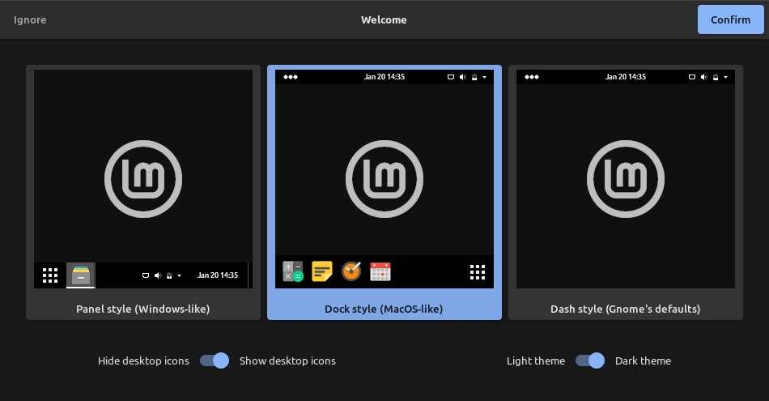
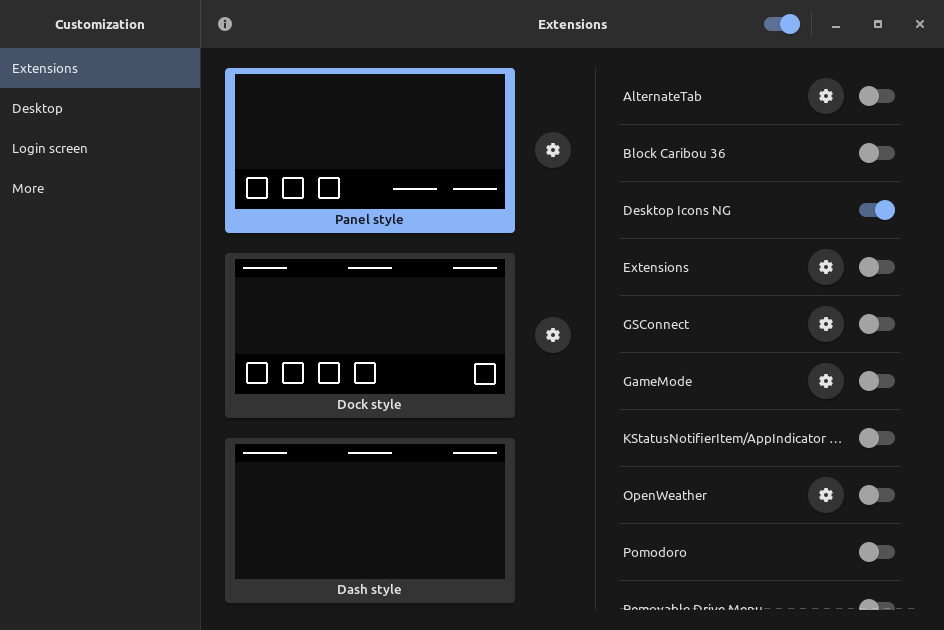
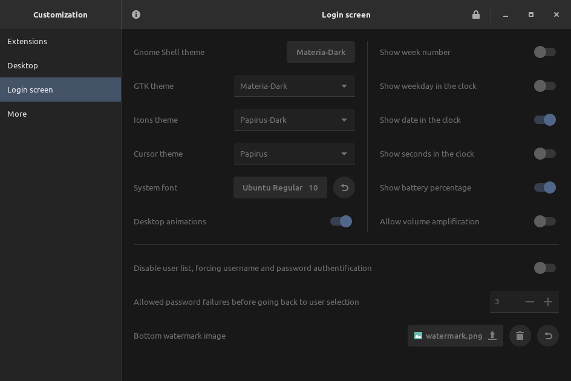
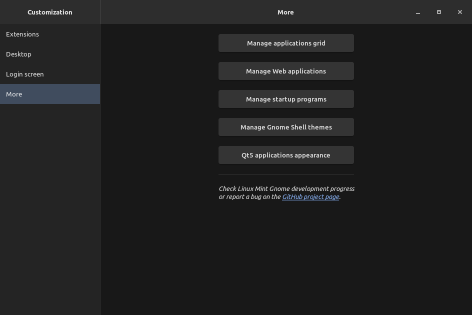

# Linux Mint Gnome

Who needs a description? Everything is in the title!

This distribution embeds 'Dash to Panel', 'Dash to Dock' and other Gnome extensions.
On first login, you can choose between a 'panel style' (Windows-like), a 'dock style' (macOS-like) or a 'dash style' (Gnome's defaults), whether or not to display desktop icons, and to opt for a light or a dark theme (everything can be changed later in 'Customization').

I'm not afiliated with Linux Mint, this is a "fan-made" distribution without any pretension.

## Screenshots

<table>
  <tbody>
    <tr>
      <td colspan="3" rowspan="2"> <i>Click on one of the three styles below ("Panel", "Dock" and "Dash") 
      Or else, you can also check the <b><a href="https://github.com/pl453s/linux-mint-gnome/blob/main/tour/tour.md">INTERACTIVE TOUR</a></b></i> </td>
    </tr>
    <tr>
    </tr>
    <tr>
      <td>  </td>
      <td>  </td>
      <td>  </td>
    </tr>
  </tbody>
</table>

<table>
  <tbody>
    <tr>
      <td colspan="2" rowspan="2"> <b>Developed windows (Python GTK)</b> </td>
      <td rowspan="3">  </td>
    </tr>
    <tr>
    </tr>
    <tr>
      <td colspan="2">  </td>
    </tr>
  </tbody>
</table>

## Installation (1.6)

**WARNING: Your computer may be wiped, depending of what you choose to do at the installation.**  
**WARNING: Updates has not been tested yet, you are warned, be very careful and know what you do.**

- Download the ISO: [https://github.com/pl453s/linux-mint-gnome/releases/download/ISO-v1.6-mint20/lmg.iso](https://github.com/pl453s/linux-mint-gnome/releases/download/ISO-v1.6-mint20/lmg.iso)
- Burn it on a disk, or flash it on an USB flash drive, or just insert it in a virtual machine
- Boot your disk or your USB flash drive, and test or install the distribution

 

**You can also migrate from an official Mint edition installation or upgrade your Mint Gnome installation:**  
**WARNING: Some symlinks are missing to avoid breaking GitHub Pages ; refer to the 'symlinks' file**

Mint Gnome development has become too complex to support scripted migration from official Mint editions.  
Now, the DEB files will be released "as is", use them to migrate by yourself or to upgrade your Mint Gnome installation.  
A separate ISO file will be published, once at a time, each time the project has evolved enough and is stable enough.

Latest release (1.7): [https://github.com/pl453s/linux-mint-gnome/releases/tag/v1.7-mint20](https://github.com/pl453s/linux-mint-gnome/releases/tag/v1.7-mint20)

## Project packages

- mint-gnome-core: Mint Gnome session, various adjustments, default schemas and default user folder
- mint-gnome-control-center: 'Settings' application with some fixes (remove Appearance + Whoopsie)
- mint-gnome-control-center-data: 'Settings' application data with some fixes (use Linux Mint logo icon)
- mint-gnome-extensions : Top Indicator, Desktop Icons NG, Dash to Panel, Dash to Dock and User Themes
- mint-gnome-theme: 'Materia' theme with some fixes (on screen keyboard icons + app-folder bug)
- mint-gnome-welcome: First login Python GTK welcome screen (change style, desktop and theme)
- gnome-customization: 'gnome-tweaks', only better (customize Gnome, Qt5, GDM3, Plymouth and Grub)
- plymouth-theme-mint: Spinner boot screen which supports UEFI manufacturer logo (BGRT)
- papirus-cursor-theme: Cursors from 'Paper' icon theme
- libreoffice-style-papirus: LibreOffice 'Papirus' style icon pack
- mint-info-gnome: Necessary information about the Linux Mint release and edition (here Gnome)

## Gnome Customization

The tabbed GUI is currently in development! The final aim is to create a central GUI to customize:  
styles, extensions, appearance, applications grid, user's folders paths, Gnome, Qt5, GDM3, Plymouth and Grub.

<table>
  <tbody>
    <tr>
      <td>  </td>
      <td>  </td>
    </tr>
    <tr>
      <td>  </td>
      <td>  </td>
    </tr>
  </tbody>
</table>

## Remaining work

- Desktop Icons: Improve localization
- Nautilus extension: Folder color switch
- Nautilus extension: Fix "Paste Into Folder" bug
- Nautilus extension: Open terminal (only background)
- Nautilus extension: Open as administrator
- Develop Gnome Customization
- ISO full test + Test installing updates
- PUBLISH A NEW ISO FILE

## Credits

- 'Top Indicator extension' forked by 'quiro9' --> [https://github.com/ubuntu/gnome-shell-extension-appindicator](https://github.com/ubuntu/gnome-shell-extension-appindicator)
- 'Desktop Icons NG extension' created by 'rastersoft' --> [https://gitlab.com/rastersoft/desktop-icons-ng](https://gitlab.com/rastersoft/desktop-icons-ng)
- 'Dash to Panel extension' created by 'jderose9' --> [https://github.com/home-sweet-gnome/dash-to-panel](https://github.com/home-sweet-gnome/dash-to-panel)
- 'Dash to Dock extension' created by 'micheleg' --> [https://github.com/micheleg/dash-to-dock](https://github.com/micheleg/dash-to-dock)
- 'Papirus icon theme' created by 'varlesh' --> [https://github.com/PapirusDevelopmentTeam/papirus-icon-theme](https://github.com/PapirusDevelopmentTeam/papirus-icon-theme)
- 'Paper icon theme' created by 'snwh' --> [https://github.com/snwh/paper-icon-theme](https://github.com/snwh/paper-icon-theme)
- 'Materia GTK theme' created by 'nana-4' --> [https://github.com/nana-4/materia-theme](https://github.com/nana-4/materia-theme)
- 'Gnome Tweaks' created by 'John Stowers' --> [https://github.com/GNOME/gnome-tweaks](https://github.com/GNOME/gnome-tweaks)
