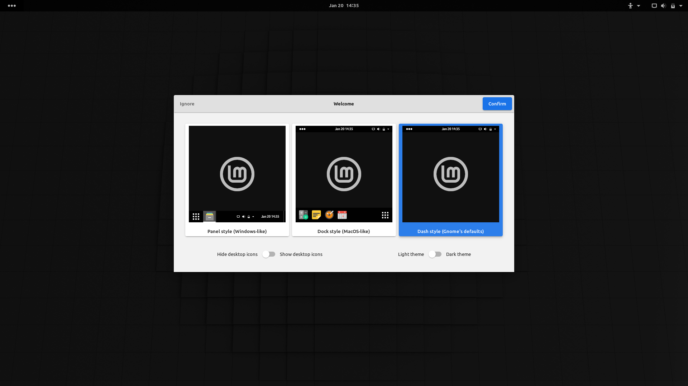

# Interactive tour

  
<b>Text is boring isn't it?</b>  
<b>This is fine, you can also just explore through this "interactive tour".</b>  
<b>It's a bit more "concrete" and visual!</b>
  

                

  
  
  &emsp;&emsp;
  
  
  
  &emsp;
  
  
  &emsp;&emsp;
  
  

                

  
  
  &emsp;&emsp;
  
  
  
  &emsp;
  
  
  &emsp;&emsp;
  
  

                

  
  
  &emsp;&emsp;
  
  
  
  &emsp;
  
  
  &emsp;&emsp;
  
  

                

  
  
  &emsp;&emsp;
  
  
  
  &emsp;
  
  
  &emsp;&emsp;
  
  

                

  
  
  &emsp;&emsp;
  
  
  
  &emsp;
  
  
  &emsp;&emsp;
  
  

                

  
  
  &emsp;&emsp;
  
  
  
  &emsp;
  
  
  &emsp;&emsp;
  
  

                

  
  
  &emsp;&emsp;
  
  
  
  &emsp;
  
  
  &emsp;&emsp;
  
  

                

  
  
  &emsp;&emsp;
  
  
  
  &emsp;
  
  
  &emsp;&emsp;
  
  

                

  
  
  &emsp;&emsp;
  
  
  
  &emsp;
  
  
  &emsp;&emsp;
  
  

                

  
  
  &emsp;&emsp;
  
  
  
  &emsp;
  
  
  &emsp;&emsp;
  
  

                

  
  
  &emsp;&emsp;
  
  
  
  &emsp;
  
  
  &emsp;&emsp;
  
  

                

  
  
  &emsp;&emsp;
  
  
  
  &emsp;
  
  
  &emsp;&emsp;
  
  

                

  
  
  &emsp;&emsp;
  
  
  
  &emsp;
  
  
  &emsp;&emsp;
  
  

                

  
  
  &emsp;&emsp;
  
  
  
  &emsp;
  
  
  &emsp;&emsp;
  
  

                

  
  
  &emsp;&emsp;
  
  
  
  &emsp;
  
  
  &emsp;&emsp;
  
  

                

  
  
  &emsp;&emsp;
  
  
  
  &emsp;
  
  
  &emsp;&emsp;
  
  

                

  
  
  &emsp;&emsp;
  
  
  
  &emsp;
  
  
  &emsp;&emsp;
  
  

                

  
  
  &emsp;&emsp;
  
  
  
  &emsp;
  
  
  &emsp;&emsp;
  
  

                

  
  
  &emsp;&emsp;
  
  
  
  &emsp;
  
  
  &emsp;&emsp;
  
  

                

  
  
  &emsp;&emsp;
  
  
  
  &emsp;
  
  
  &emsp;&emsp;
  
  

                

  
  
  &emsp;&emsp;
  
  
  
  &emsp;
  
  
  &emsp;&emsp;
  
  

                

  
  
  &emsp;&emsp;
  
  
  
  &emsp;
  
  
  &emsp;&emsp;
  
  

                

  
  
  &emsp;&emsp;
  
  
  
  &emsp;
  
  
  &emsp;&emsp;
  
  

                

  
  
  &emsp;&emsp;
  
  
  
  &emsp;
  
  
  &emsp;&emsp;
  
  

                

  
  
  &emsp;&emsp;
  
  
  
  &emsp;
  
  
  &emsp;&emsp;
  
  

                

  
  
  &emsp;&emsp;
  
  
  
  &emsp;
  
  
  &emsp;&emsp;
  
  

                

  
  
  &emsp;&emsp;
  
  
  
  &emsp;
  
  
  &emsp;&emsp;
  
  

                

  
  
  &emsp;&emsp;
  
  
  
  &emsp;
  
  
  &emsp;&emsp;
  
  

                

  
  
  &emsp;&emsp;
  
  
  
  &emsp;
  
  
  &emsp;&emsp;
  
  

                

  
  
  &emsp;&emsp;
  
  
  
  &emsp;
  
  
  &emsp;&emsp;
  
  

                

  
  
  &emsp;&emsp;
  
  
  
  &emsp;
  
  
  &emsp;&emsp;
  
  

                

  
  
  &emsp;&emsp;
  
  
  
  &emsp;
  
  
  &emsp;&emsp;
  
  

                

  
  
  &emsp;&emsp;
  
  
  
  &emsp;
  
  
  &emsp;&emsp;
  
  

                

  
  
  &emsp;&emsp;
  
  
  
  &emsp;
  
  
  &emsp;&emsp;
  
  

                

  
  
  &emsp;&emsp;
  
  
  
  &emsp;
  
  
  &emsp;&emsp;
  
  

                

  
  
  &emsp;&emsp;
  
  
  
  &emsp;
  
  
  &emsp;&emsp;
  
  

                

  
  
  &emsp;&emsp;
  
  
  
  &emsp;
  
  
  &emsp;&emsp;
  
  

                

  
  
  &emsp;&emsp;
  
  
  
  &emsp;
  
  
  &emsp;&emsp;
  
  

                

  
  
  &emsp;&emsp;
  
  
  
  &emsp;
  
  
  &emsp;&emsp;
  
  

                

  
  
  &emsp;&emsp;
  
  
  
  &emsp;
  
  
  &emsp;&emsp;
  
  

                

  
  
  &emsp;&emsp;
  
  
  
  &emsp;
  
  
  &emsp;&emsp;
  
  

                

  
  
  &emsp;&emsp;
  
  
  
  &emsp;
  
  
  &emsp;&emsp;
  
  

                

  
  
  &emsp;&emsp;
  
  
  
  &emsp;
  
  
  &emsp;&emsp;
  
  

                

  
  
  &emsp;&emsp;
  
  
  
  &emsp;
  
  
  &emsp;&emsp;
  
  

                

  
  
  &emsp;&emsp;
  
  
  
  &emsp;
  
  
  &emsp;&emsp;
  
  

                

  
  
  &emsp;&emsp;
  
  
  
  &emsp;
  
  
  &emsp;&emsp;
  
  

                

  
  
  &emsp;&emsp;
  
  
  
  &emsp;
  
  
  &emsp;&emsp;
  
  

                

  
  
  &emsp;&emsp;
  
  
  
  &emsp;
  
  
  &emsp;&emsp;
  
  

                

