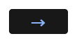

# Interactive tour (1lws)

 
 
 
 
 
 
 
 
 
 
 
 
 
 
 
 

# Interactive tour (1lwh)

 
 
 
 
 
 
 
 
 
 
 
 
 
 
 
 

# Interactive tour (1lms)

 
 
 
 
 
 
 
 
 
 
 
 
 
 
 
 

# Interactive tour (1lmh)

 
 
 
 
 
 
 
 
 
 
 
 
 
 
 
 

# Interactive tour (1lgs)

 
 
 
 
 
 
 
 
 
 
 
 
 
 
 
 

# Interactive tour (1lgh)

 
 
 
 
 
 
 
 
 
 
 
 
 
 
 
 

# Interactive tour (1dws)

 
 
 
 
 
 
 
 
 
 
 
 
 
 
 
 

# Interactive tour (1dwh)

 
 
 
 
 
 
 
 
 
 
 
 
 
 
 
 

# Interactive tour (1dms)

 
 
 
 
 
 
 
 
 
 
 
 
 
 
 
 

# Interactive tour (1dmh)

 
 
 
 
 
 
 
 
 
 
 
 
 
 
 
 

# Interactive tour (1dgs)

 
 
 
 
 
 
 
 
 
 
 
 
 
 
 
 

# Interactive tour (1dgh)

 
 
 
 
 
 
 
 
 
 
 
 
 
 
 
 

# Interactive tour (2lws)

 
 
 
 
 
 
 
 
 
 
 
 
 
 
 
 

# Interactive tour (2lwh)

 
 
 
 
 
 
 
 
 
 
 
 
 
 
 
 

# Interactive tour (2lms)

 
 
 
 
 
 
 
 
 
 
 
 
 
 
 
 

# Interactive tour (2lmh)

 
 
 
 
 
 
 
 
 
 
 
 
 
 
 
 

# Interactive tour (2lgs)

 
 
 
 
 
 
 
 
 
 
 
 
 
 
 
 

# Interactive tour (2lgh)

 
 
 
 
 
 
 
 
 
 
 
 
 
 
 
 

# Interactive tour (2dws)

 
 
 
 
 
 
 
 
 
 
 
 
 
 
 
 

# Interactive tour (2dwh)

 
 
 
 
 
 
 
 
 
 
 
 
 
 
 
 

# Interactive tour (2dms)

 
 
 
 
 
 
 
 
 
 
 
 
 
 
 
 

# Interactive tour (2dmh)

 
 
 
 
 
 
 
 
 
 
 
 
 
 
 
 

# Interactive tour (2dgs)

 
 
 
 
 
 
 
 
 
 
 
 
 
 
 
 

# Interactive tour (2dgh)

 
 
 
 
 
 
 
 
 
 
 
 
 
 
 
 

# Interactive tour (3lws)

 
 
 
 
 
 
 
 
 
 
 
 
 
 
 
 

# Interactive tour (3lwh)

 
 
 
 
 
 
 
 
 
 
 
 
 
 
 
 

# Interactive tour (3lms)

 
 
 
 
 
 
 
 
 
 
 
 
 
 
 
 

# Interactive tour (3lmh)

 
 
 
 
 
 
 
 
 
 
 
 
 
 
 
 

# Interactive tour (3lgs)

 
 
 
 
 
 
 
 
 
 
 
 
 
 
 
 

# Interactive tour (3lgh)

 
 
 
 
 
 
 
 
 
 
 
 
 
 
 
 

# Interactive tour (3dws)

 
 
 
 
 
 
 
 
 
 
 
 
 
 
 
 

# Interactive tour (3dwh)

 
 
 
 
 
 
 
 
 
 
 
 
 
 
 
 

# Interactive tour (3dms)

 
 
 
 
 
 
 
 
 
 
 
 
 
 
 
 

# Interactive tour (3dmh)

 
 
 
 
 
 
 
 
 
 
 
 
 
 
 
 

# Interactive tour (3dgs)

 
 
 
 
 
 
 
 
 
 
 
 
 
 
 
 

# Interactive tour (3dgh)

 
 
 
 
 
 
 
 
 
 
 
 
 
 
 
 

# Interactive tour (4lws)

 
 
 
 
 
 
 
 
 
 
 
 
 
 
 
 

# Interactive tour (4lwh)

 
 
 
 
 
 
 
 
 
 
 
 
 
 
 
 

# Interactive tour (4lms)

 
 
 
 
 
 
 
 
 
 
 
 
 
 
 
 

# Interactive tour (4lmh)

 
 
 
 
 
 
 
 
 
 
 
 
 
 
 
 

# Interactive tour (4lgs)

 
 
 
 
 
 
 
 
 
 
 
 
 
 
 
 

# Interactive tour (4lgh)

 
 
 
 
 
 
 
 
 
 
 
 
 
 
 
 

# Interactive tour (4dws)

 
 
 
 
 
 
 
 
 
 
 
 
 
 
 
 

# Interactive tour (4dwh)

 
 
 
 
 
 
 
 
 
 
 
 
 
 
 
 

# Interactive tour (4dms)

 
 
 
 
 
 
 
 
 
 
 
 
 
 
 
 

# Interactive tour (4dmh)

 
 
 
 
 
 
 
 
 
 
 
 
 
 
 
 

# Interactive tour (4dgs)

 
 
 
 
 
 
 
 
 
 
 
 
 
 
 
 

# Interactive tour (4dgh)

 
 
 
 
 
 
 
 
 
 
 
 
 
 
 
 
