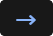
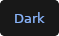
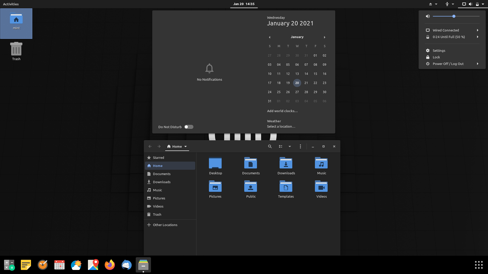

&emsp;&emsp;&emsp;
&emsp;&emsp;&emsp;

&emsp;&emsp;&emsp;

<table>
  <tbody>
    <tr>
      <td colspan="12">  </td>
    </tr>
    <tr>
      <td>  </td>
      <td>  </td>
      <td> &emsp; </td>
      <td>  </td>
      <td> &emsp; </td>
      <td>  </td>
      <td>  </td>
      <td>  </td>
      <td> &emsp; </td>
      <td>  </td>
      <td> &emsp; </td>
      <td>  </td>
    </tr>
  </tbody>
</table>
