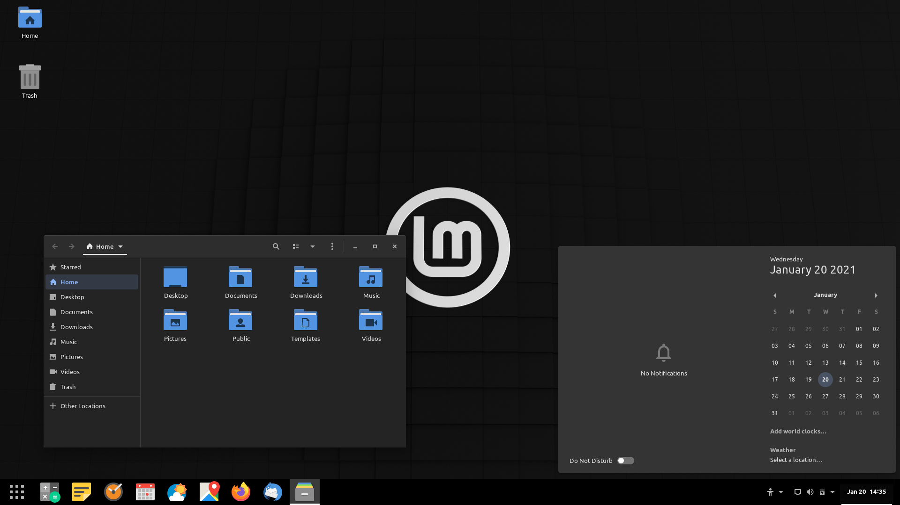

                

  
  
  &emsp;&emsp;
  
  
  
  &emsp;
  
  
  &emsp;&emsp;
  
  

                

  
  
  &emsp;&emsp;
  
  
  
  &emsp;
  
  
  &emsp;&emsp;
  
  

                

  
  
  &emsp;&emsp;
  
  
  
  &emsp;
  
  
  &emsp;&emsp;
  
  

                

  
  
  &emsp;&emsp;
  
  
  
  &emsp;
  
  
  &emsp;&emsp;
  
  

                

  
  
  &emsp;&emsp;
  
  
  
  &emsp;
  
  
  &emsp;&emsp;
  
  

                

  
  
  &emsp;&emsp;
  
  
  
  &emsp;
  
  
  &emsp;&emsp;
  
  

                

  
  
  &emsp;&emsp;
  
  
  
  &emsp;
  
  
  &emsp;&emsp;
  
  

                

  
  
  &emsp;&emsp;
  
  
  
  &emsp;
  
  
  &emsp;&emsp;
  
  

                

  
  
  &emsp;&emsp;
  
  
  
  &emsp;
  
  
  &emsp;&emsp;
  
  

                

  
  
  &emsp;&emsp;
  
  
  
  &emsp;
  
  
  &emsp;&emsp;
  
  

                

  
  
  &emsp;&emsp;
  
  
  
  &emsp;
  
  
  &emsp;&emsp;
  
  

                

  
  
  &emsp;&emsp;
  
  
  
  &emsp;
  
  
  &emsp;&emsp;
  
  

                

  
  
  &emsp;&emsp;
  
  
  
  &emsp;
  
  
  &emsp;&emsp;
  
  

                

  
  
  &emsp;&emsp;
  
  
  
  &emsp;
  
  
  &emsp;&emsp;
  
  

                

  
  
  &emsp;&emsp;
  
  
  
  &emsp;
  
  
  &emsp;&emsp;
  
  

                

  
  
  &emsp;&emsp;
  
  
  
  &emsp;
  
  
  &emsp;&emsp;
  
  

                

  
  
  &emsp;&emsp;
  
  
  
  &emsp;
  
  
  &emsp;&emsp;
  
  

                

  
  
  &emsp;&emsp;
  
  
  
  &emsp;
  
  
  &emsp;&emsp;
  
  

                

  
  
  &emsp;&emsp;
  
  
  
  &emsp;
  
  
  &emsp;&emsp;
  
  

                

  
  
  &emsp;&emsp;
  
  
  
  &emsp;
  
  
  &emsp;&emsp;
  
  

                

  
  
  &emsp;&emsp;
  
  
  
  &emsp;
  
  
  &emsp;&emsp;
  
  

                

  
  
  &emsp;&emsp;
  
  
  
  &emsp;
  
  
  &emsp;&emsp;
  
  

                

  
  
  &emsp;&emsp;
  
  
  
  &emsp;
  
  
  &emsp;&emsp;
  
  

                

  
  
  &emsp;&emsp;
  
  
  
  &emsp;
  
  
  &emsp;&emsp;
  
  

                

  
  
  &emsp;&emsp;
  
  
  
  &emsp;
  
  
  &emsp;&emsp;
  
  

                

  
  
  &emsp;&emsp;
  
  
  
  &emsp;
  
  
  &emsp;&emsp;
  
  

                

  
  
  &emsp;&emsp;
  
  
  
  &emsp;
  
  
  &emsp;&emsp;
  
  

                

  
  
  &emsp;&emsp;
  
  
  
  &emsp;
  
  
  &emsp;&emsp;
  
  

                

  
  
  &emsp;&emsp;
  
  
  
  &emsp;
  
  
  &emsp;&emsp;
  
  

                

  
  
  &emsp;&emsp;
  
  
  
  &emsp;
  
  
  &emsp;&emsp;
  
  

                

  
  
  &emsp;&emsp;
  
  
  
  &emsp;
  
  
  &emsp;&emsp;
  
  

                

  
  
  &emsp;&emsp;
  
  
  
  &emsp;
  
  
  &emsp;&emsp;
  
  

                

  
  
  &emsp;&emsp;
  
  
  
  &emsp;
  
  
  &emsp;&emsp;
  
  

                

  
  
  &emsp;&emsp;
  
  
  
  &emsp;
  
  
  &emsp;&emsp;
  
  

                

  
  
  &emsp;&emsp;
  
  
  
  &emsp;
  
  
  &emsp;&emsp;
  
  

                

  
  
  &emsp;&emsp;
  
  
  
  &emsp;
  
  
  &emsp;&emsp;
  
  

                

  
  
  &emsp;&emsp;
  
  
  
  &emsp;
  
  
  &emsp;&emsp;
  
  

                

  
  
  &emsp;&emsp;
  
  
  
  &emsp;
  
  
  &emsp;&emsp;
  
  

                

  
  
  &emsp;&emsp;
  
  
  
  &emsp;
  
  
  &emsp;&emsp;
  
  

                

  
  
  &emsp;&emsp;
  
  
  
  &emsp;
  
  
  &emsp;&emsp;
  
  

                

  
  
  &emsp;&emsp;
  
  
  
  &emsp;
  
  
  &emsp;&emsp;
  
  

                

  
  
  &emsp;&emsp;
  
  
  
  &emsp;
  
  
  &emsp;&emsp;
  
  

                

  
  
  &emsp;&emsp;
  
  
  
  &emsp;
  
  
  &emsp;&emsp;
  
  

                

  
  
  &emsp;&emsp;
  
  
  
  &emsp;
  
  
  &emsp;&emsp;
  
  

                

  
  
  &emsp;&emsp;
  
  
  
  &emsp;
  
  
  &emsp;&emsp;
  
  

                

  
  
  &emsp;&emsp;
  
  
  
  &emsp;
  
  
  &emsp;&emsp;
  
  

                

  
  
  &emsp;&emsp;
  
  
  
  &emsp;
  
  
  &emsp;&emsp;
  
  

                

  
  
  &emsp;&emsp;
  
  
  
  &emsp;
  
  
  &emsp;&emsp;
  
  

