# Interactive tour

 
 

**Text is boring isn't it?**  
**This is fine, you can also just explore through this "interactive tour".**  
**It's a bit more "concrete" and visual!**

 
 

 
 
 
 
 
 
 
 
 
 
 
 
 
 
 
 

# Interactive tour (1lws)

 
 
 
 
 
 
 
 
 
 
 
 
 
 
 
 

# Interactive tour (1lwh)

 
 
 
 
 
 
 
 
 
 
 
 
 
 
 
 

# Interactive tour (1lms)

 
 
 
 
 
 
 
 
 
 
 
 
 
 
 
 

# Interactive tour (1lmh)

 
 
 
 
 
 
 
 
 
 
 
 
 
 
 
 

# Interactive tour (1lgs)

 
 
 
 
 
 
 
 
 
 
 
 
 
 
 
 

# Interactive tour (1lgh)

 
 
 
 
 
 
 
 
 
 
 
 
 
 
 
 

# Interactive tour (1dws)

 
 
 
 
 
 
 
 
 
 
 
 
 
 
 
 

# Interactive tour (1dwh)

 
 
 
 
 
 
 
 
 
 
 
 
 
 
 
 

# Interactive tour (1dms)

 
 
 
 
 
 
 
 
 
 
 
 
 
 
 
 

# Interactive tour (1dmh)

 
 
 
 
 
 
 
 
 
 
 
 
 
 
 
 

# Interactive tour (1dgs)

 
 
 
 
 
 
 
 
 
 
 
 
 
 
 
 

# Interactive tour (1dgh)

 
 
 
 
 
 
 
 
 
 
 
 
 
 
 
 

# Interactive tour (2lws)

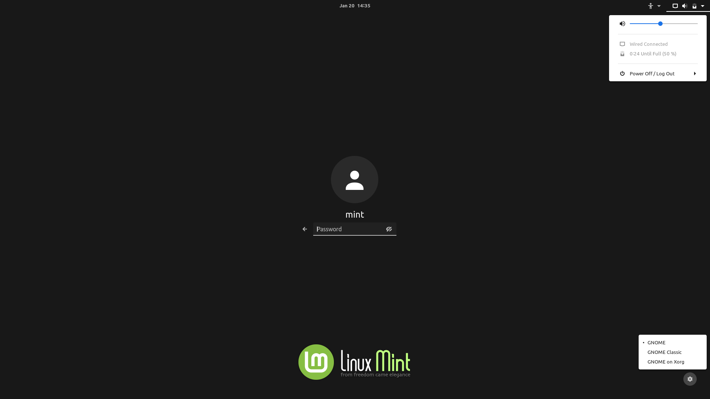

&emsp;&emsp;&emsp;

 
 
 
 
 
 
 
 
 
 
 
 
 
 
 
 

# Interactive tour (2lwh)

&emsp;&emsp;&emsp;

 
 
 
 
 
 
 
 
 
 
 
 
 
 
 
 

# Interactive tour (2lms)

&emsp;&emsp;&emsp;

 
 
 
 
 
 
 
 
 
 
 
 
 
 
 
 

# Interactive tour (2lmh)

&emsp;&emsp;&emsp;

 
 
 
 
 
 
 
 
 
 
 
 
 
 
 
 

# Interactive tour (2lgs)

&emsp;&emsp;&emsp;

 
 
 
 
 
 
 
 
 
 
 
 
 
 
 
 

# Interactive tour (2lgh)

&emsp;&emsp;&emsp;

 
 
 
 
 
 
 
 
 
 
 
 
 
 
 
 

# Interactive tour (2dws)

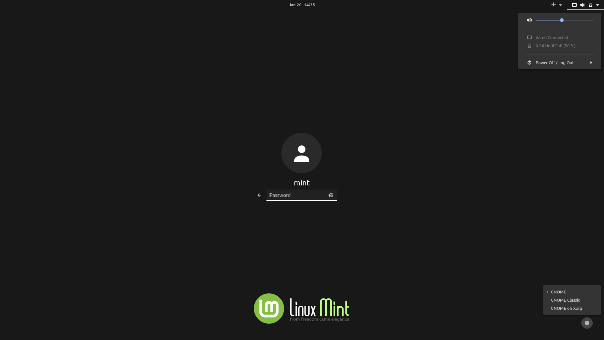

&emsp;&emsp;&emsp;

 
 
 
 
 
 
 
 
 
 
 
 
 
 
 
 

# Interactive tour (2dwh)

&emsp;&emsp;&emsp;

 
 
 
 
 
 
 
 
 
 
 
 
 
 
 
 

# Interactive tour (2dms)

&emsp;&emsp;&emsp;

 
 
 
 
 
 
 
 
 
 
 
 
 
 
 
 

# Interactive tour (2dmh)

&emsp;&emsp;&emsp;

 
 
 
 
 
 
 
 
 
 
 
 
 
 
 
 

# Interactive tour (2dgs)

&emsp;&emsp;&emsp;

 
 
 
 
 
 
 
 
 
 
 
 
 
 
 
 

# Interactive tour (2dgh)

&emsp;&emsp;&emsp;

 
 
 
 
 
 
 
 
 
 
 
 
 
 
 
 

# Interactive tour (3lws)

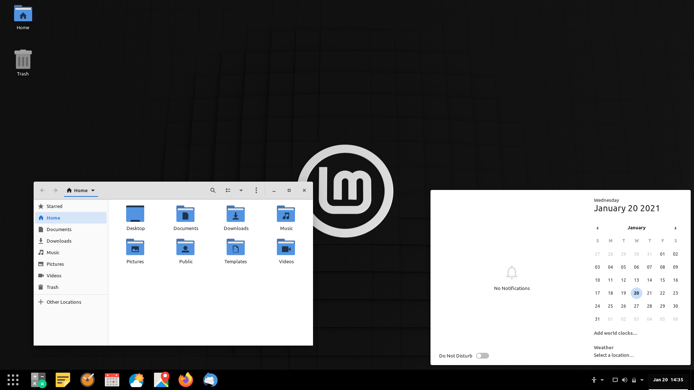

&emsp;&emsp;&emsp;
&emsp;&emsp;&emsp;

&emsp;&emsp;&emsp;

 
 
 
 
 
 
 
 
 
 
 
 
 
 
 
 

# Interactive tour (3lwh)

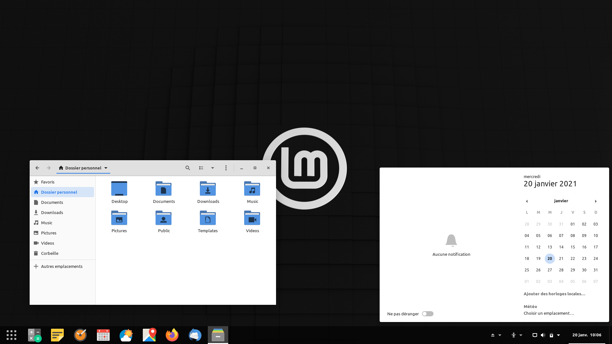

&emsp;&emsp;&emsp;
&emsp;&emsp;&emsp;

&emsp;&emsp;&emsp;

 
 
 
 
 
 
 
 
 
 
 
 
 
 
 
 

# Interactive tour (3lms)

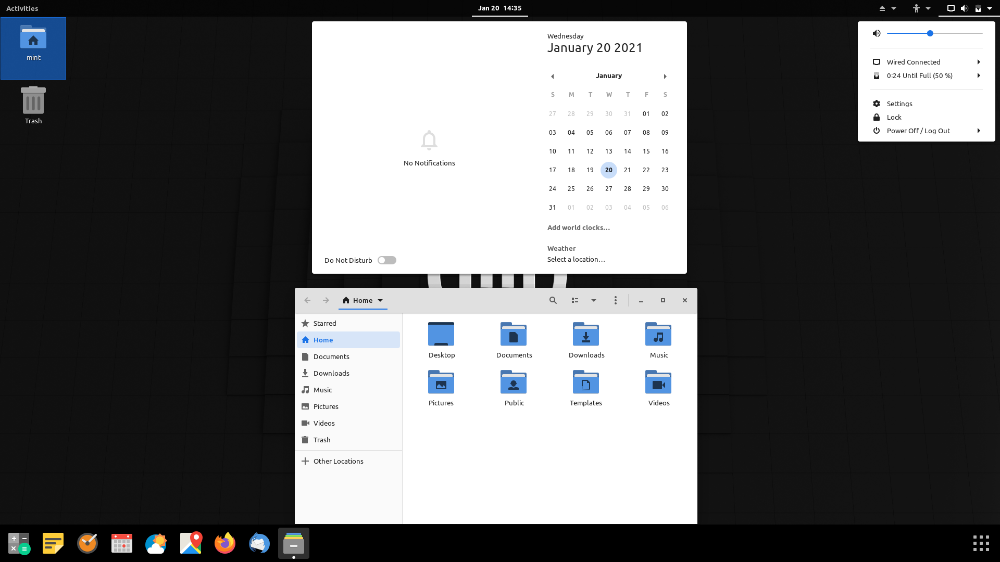

&emsp;&emsp;&emsp;
&emsp;&emsp;&emsp;

&emsp;&emsp;&emsp;

 
 
 
 
 
 
 
 
 
 
 
 
 
 
 
 

# Interactive tour (3lmh)

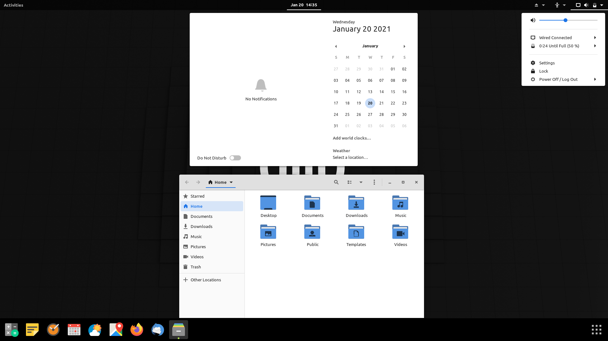

&emsp;&emsp;&emsp;
&emsp;&emsp;&emsp;

&emsp;&emsp;&emsp;

 
 
 
 
 
 
 
 
 
 
 
 
 
 
 
 

# Interactive tour (3lgs)

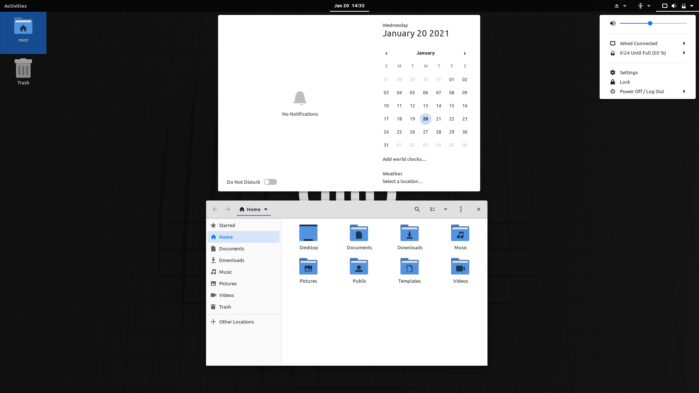

&emsp;&emsp;&emsp;
&emsp;&emsp;&emsp;

&emsp;&emsp;&emsp;

 
 
 
 
 
 
 
 
 
 
 
 
 
 
 
 

# Interactive tour (3lgh)

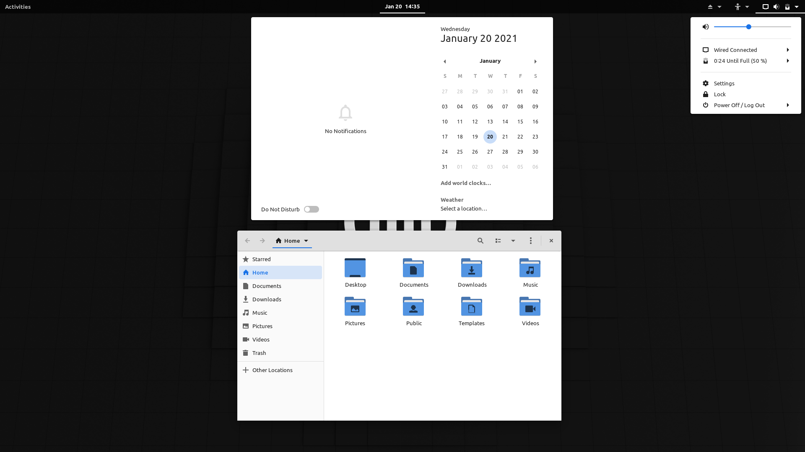

&emsp;&emsp;&emsp;
&emsp;&emsp;&emsp;

&emsp;&emsp;&emsp;

 
 
 
 
 
 
 
 
 
 
 
 
 
 
 
 

# Interactive tour (3dws)

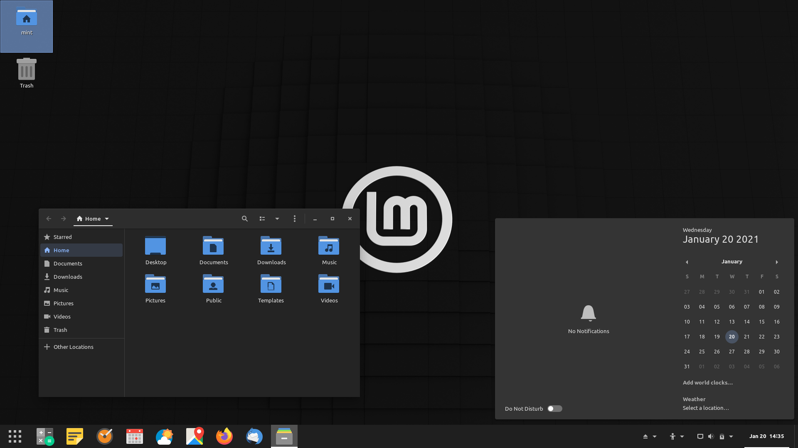

&emsp;&emsp;&emsp;
&emsp;&emsp;&emsp;

&emsp;&emsp;&emsp;

 
 
 
 
 
 
 
 
 
 
 
 
 
 
 
 

# Interactive tour (3dwh)

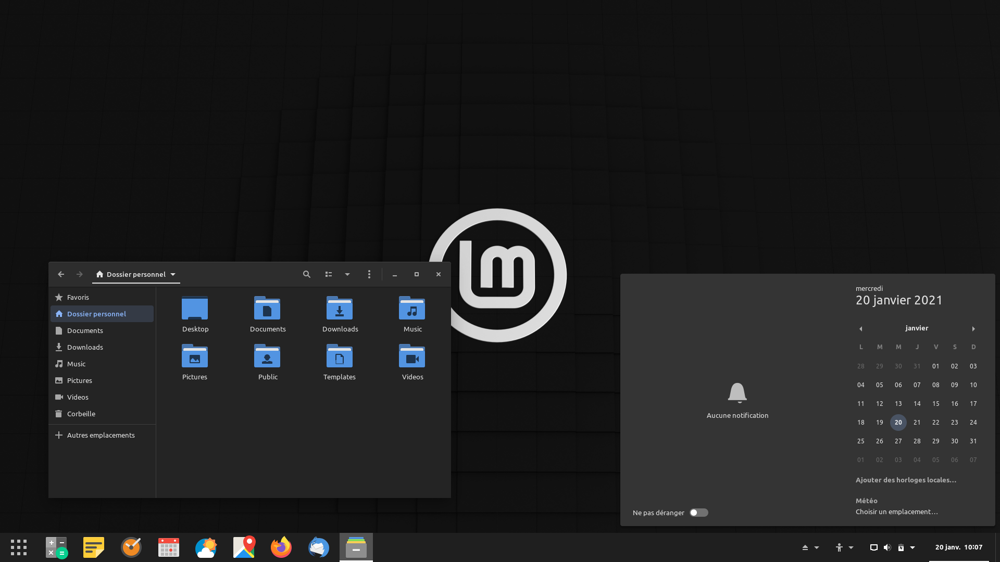

&emsp;&emsp;&emsp;
&emsp;&emsp;&emsp;

&emsp;&emsp;&emsp;

 
 
 
 
 
 
 
 
 
 
 
 
 
 
 
 

# Interactive tour (3dms)

&emsp;&emsp;&emsp;
&emsp;&emsp;&emsp;

&emsp;&emsp;&emsp;

 
 
 
 
 
 
 
 
 
 
 
 
 
 
 
 

# Interactive tour (3dmh)

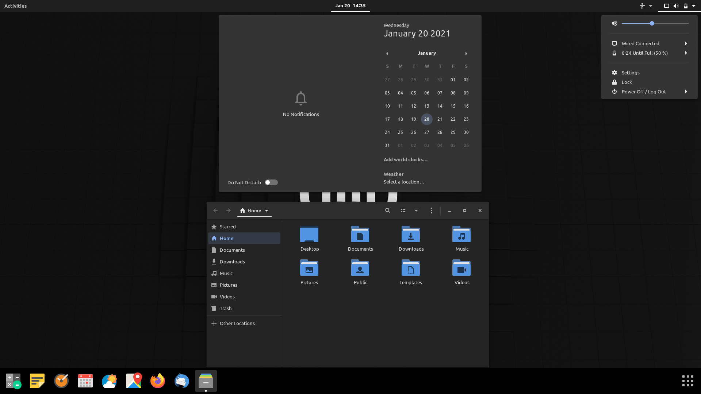

&emsp;&emsp;&emsp;
&emsp;&emsp;&emsp;

&emsp;&emsp;&emsp;

 
 
 
 
 
 
 
 
 
 
 
 
 
 
 
 

# Interactive tour (3dgs)

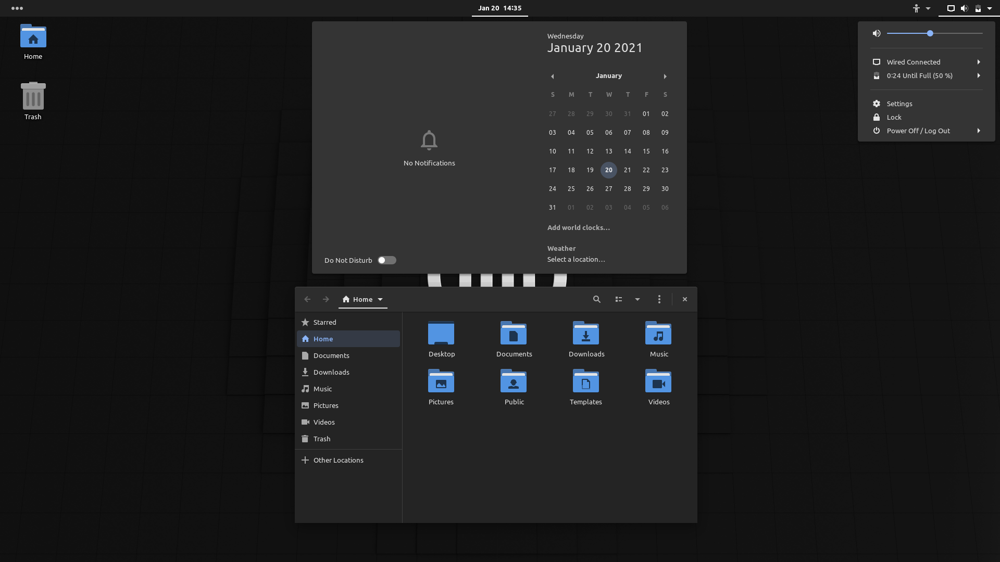

&emsp;&emsp;&emsp;
&emsp;&emsp;&emsp;

&emsp;&emsp;&emsp;

 
 
 
 
 
 
 
 
 
 
 
 
 
 
 
 

# Interactive tour (3dgh)

&emsp;&emsp;&emsp;
&emsp;&emsp;&emsp;

&emsp;&emsp;&emsp;

 
 
 
 
 
 
 
 
 
 
 
 
 
 
 
 

# Interactive tour (4lws)

&emsp;&emsp;&emsp;
&emsp;&emsp;&emsp;

 
 
 
 
 
 
 
 
 
 
 
 
 
 
 
 

# Interactive tour (4lwh)

&emsp;&emsp;&emsp;
&emsp;&emsp;&emsp;

 
 
 
 
 
 
 
 
 
 
 
 
 
 
 
 

# Interactive tour (4lms)

&emsp;&emsp;&emsp;
&emsp;&emsp;&emsp;

 
 
 
 
 
 
 
 
 
 
 
 
 
 
 
 

# Interactive tour (4lmh)

&emsp;&emsp;&emsp;
&emsp;&emsp;&emsp;

 
 
 
 
 
 
 
 
 
 
 
 
 
 
 
 

# Interactive tour (4lgs)

&emsp;&emsp;&emsp;
&emsp;&emsp;&emsp;

 
 
 
 
 
 
 
 
 
 
 
 
 
 
 
 

# Interactive tour (4lgh)

&emsp;&emsp;&emsp;
&emsp;&emsp;&emsp;

 
 
 
 
 
 
 
 
 
 
 
 
 
 
 
 

# Interactive tour (4dws)

&emsp;&emsp;&emsp;
&emsp;&emsp;&emsp;

 
 
 
 
 
 
 
 
 
 
 
 
 
 
 
 

# Interactive tour (4dwh)

&emsp;&emsp;&emsp;
&emsp;&emsp;&emsp;

 
 
 
 
 
 
 
 
 
 
 
 
 
 
 
 

# Interactive tour (4dms)

&emsp;&emsp;&emsp;
&emsp;&emsp;&emsp;

 
 
 
 
 
 
 
 
 
 
 
 
 
 
 
 

# Interactive tour (4dmh)

&emsp;&emsp;&emsp;
&emsp;&emsp;&emsp;

 
 
 
 
 
 
 
 
 
 
 
 
 
 
 
 

# Interactive tour (4dgs)

&emsp;&emsp;&emsp;
&emsp;&emsp;&emsp;

 
 
 
 
 
 
 
 
 
 
 
 
 
 
 
 

# Interactive tour (4dgh)

&emsp;&emsp;&emsp;
&emsp;&emsp;&emsp;

 
 
 
 
 
 
 
 
 
 
 
 
 
 
 
 
