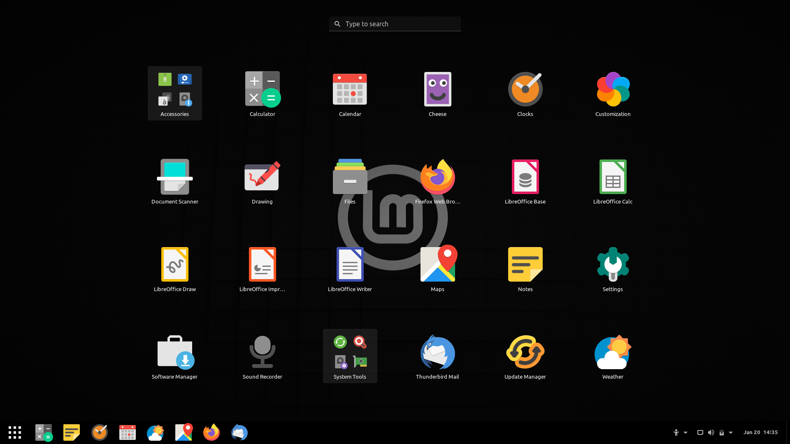
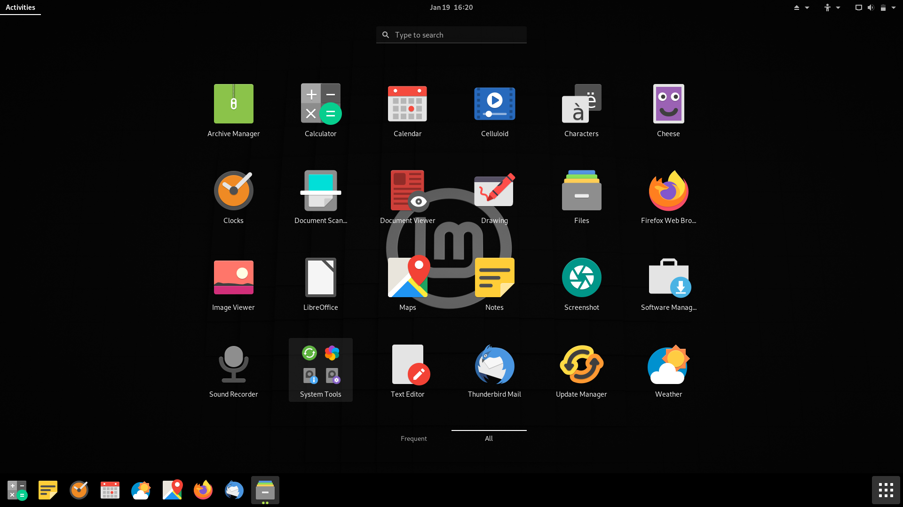
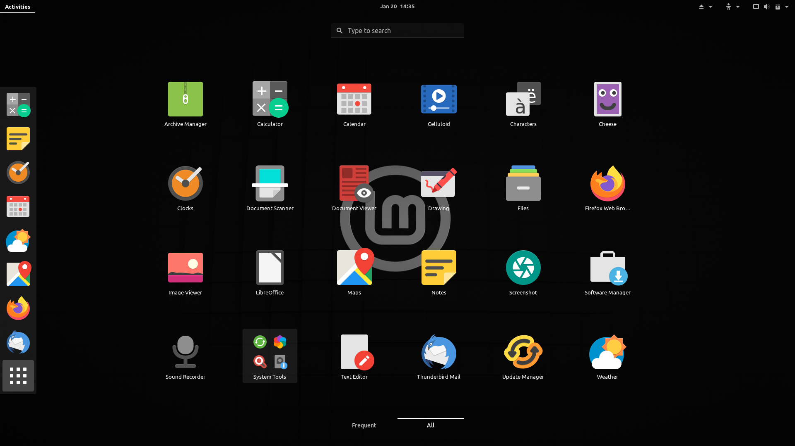
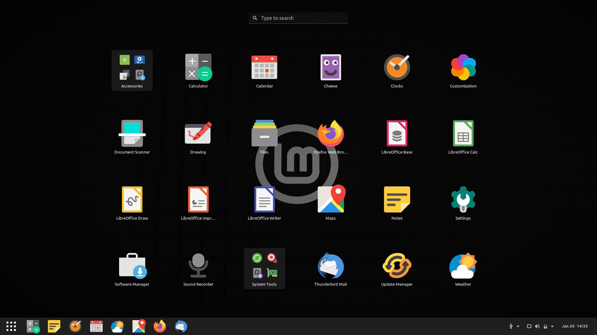
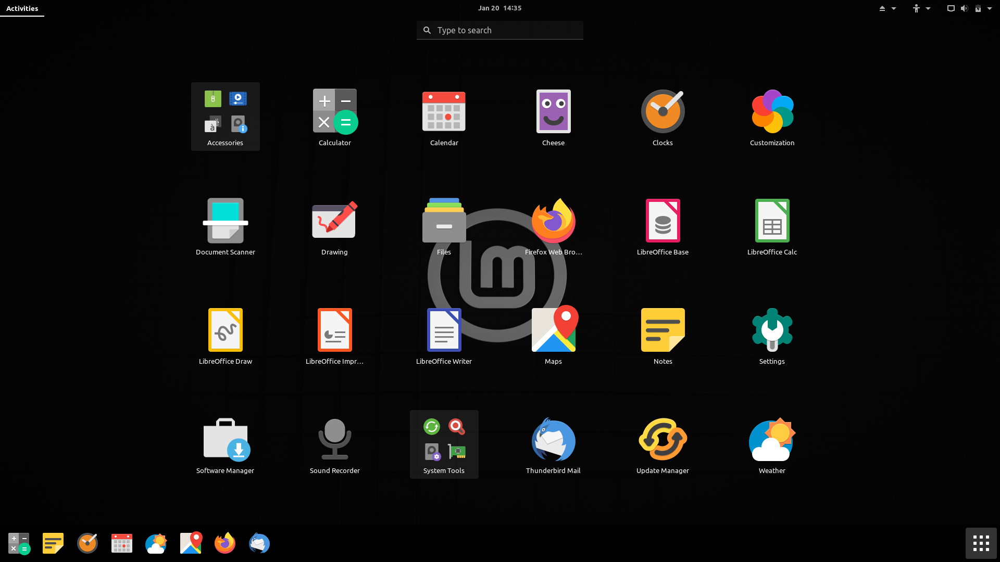
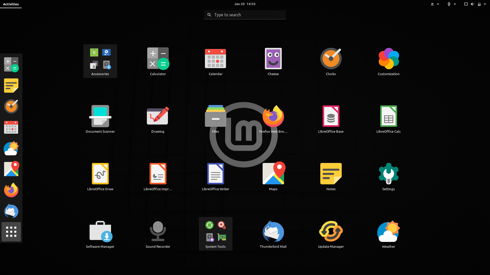

# Interactive tour (4lws)

&emsp;&emsp;&emsp;
&emsp;&emsp;&emsp;

 
 
 
 
 
 
 
 
 
 
 
 
 
 
 
 

# Interactive tour (4lwh)

&emsp;&emsp;&emsp;
&emsp;&emsp;&emsp;

 
 
 
 
 
 
 
 
 
 
 
 
 
 
 
 

# Interactive tour (4lms)

&emsp;&emsp;&emsp;
&emsp;&emsp;&emsp;

 
 
 
 
 
 
 
 
 
 
 
 
 
 
 
 

# Interactive tour (4lmh)

&emsp;&emsp;&emsp;
&emsp;&emsp;&emsp;

 
 
 
 
 
 
 
 
 
 
 
 
 
 
 
 

# Interactive tour (4lgs)

&emsp;&emsp;&emsp;
&emsp;&emsp;&emsp;

 
 
 
 
 
 
 
 
 
 
 
 
 
 
 
 

# Interactive tour (4lgh)

&emsp;&emsp;&emsp;
&emsp;&emsp;&emsp;

 
 
 
 
 
 
 
 
 
 
 
 
 
 
 
 

# Interactive tour (4dws)

&emsp;&emsp;&emsp;
&emsp;&emsp;&emsp;

 
 
 
 
 
 
 
 
 
 
 
 
 
 
 
 

# Interactive tour (4dwh)

&emsp;&emsp;&emsp;
&emsp;&emsp;&emsp;

 
 
 
 
 
 
 
 
 
 
 
 
 
 
 
 

# Interactive tour (4dms)

&emsp;&emsp;&emsp;
&emsp;&emsp;&emsp;

 
 
 
 
 
 
 
 
 
 
 
 
 
 
 
 

# Interactive tour (4dmh)

&emsp;&emsp;&emsp;
&emsp;&emsp;&emsp;

 
 
 
 
 
 
 
 
 
 
 
 
 
 
 
 

# Interactive tour (4dgs)

&emsp;&emsp;&emsp;
&emsp;&emsp;&emsp;

 
 
 
 
 
 
 
 
 
 
 
 
 
 
 
 

# Interactive tour (4dgh)

&emsp;&emsp;&emsp;
&emsp;&emsp;&emsp;

 
 
 
 
 
 
 
 
 
 
 
 
 
 
 
 
